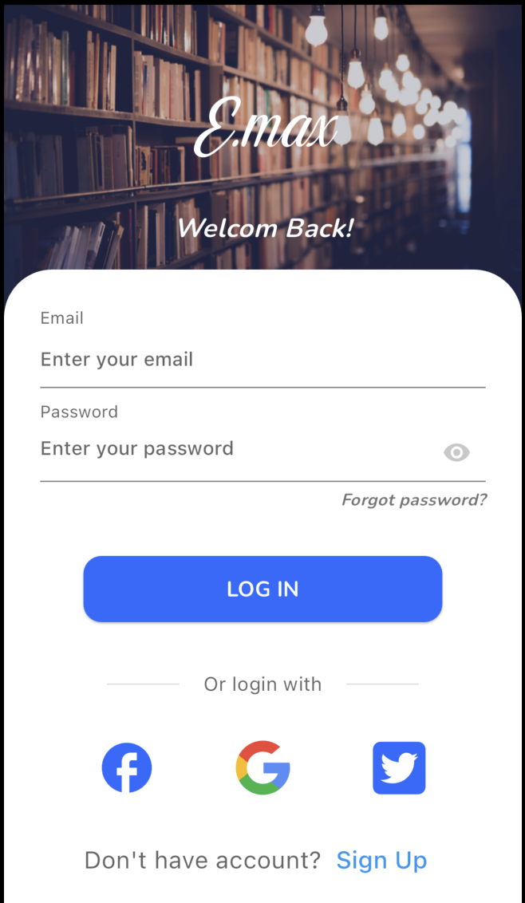
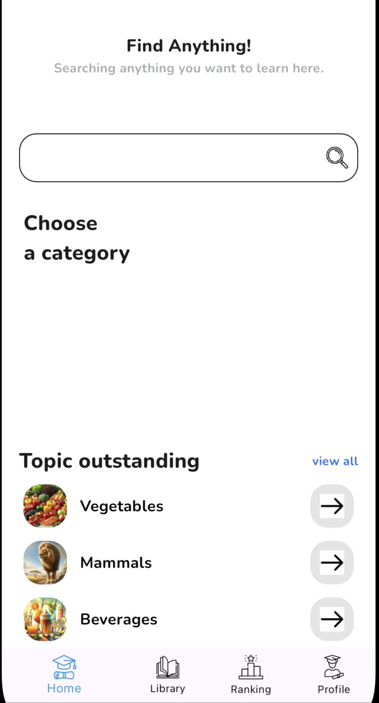

# 📱 Learning English App - EMAX

<p align="center">
  
  
</p>

A **cross-platform mobile application** built with **Flutter & Dart** to support English learners with interactive exercises and real-time communication features.

# 📱 Learning English App - EMAX


A **cross-platform mobile application** built with **Flutter & Dart** to support English learners with interactive exercises, real-time features, and community engagement.

---

## 🚀 Project Overview

**Learning English App - EMAX** is designed to make English learning more engaging, social, and personalized. The app includes:

- 🔐 **Google Sign-In** for secure authentication
- 🧑‍💼 **User Profile Management** – edit name, avatar, and bio
- 📢 **Text-to-Speech** for pronunciation practice
- 🧠 **Quizzes & Fill-in-the-blank exercises** for vocabulary & grammar
- 🥇 **Ranking Challenge Mode** to compete with other learners
- 💬 **Real-time chatbox** for dictionary lookups (Wikipedia API)
- 🔄 **Anh - Việt / Việt - Anh dictionary** with flashcard review
- 🧩 **Flashcard learning system** for memory enhancement
- 🔐 **Role-based access** to learning communities
- 🔄 **Firebase Realtime Database** for live data synchronization

---

## 🧑‍💻 My Responsibilities

### 🎨 Front-End:

- Developed using **Flutter + Dart**
- State management with **Provider**
- Flashcard & quiz modules
- Google Sign-In integration
- Profile page for user customization

### 🛠️ Back-End:

- **Firebase Realtime Database** for data sync
- **Firebase Auth** for Google login
- Role-based access rules
- Backend logic & ranking challenge with **Java**

---

## 🔑 Core Features

- ✅ Google Sign-In authentication
- ✅ User profile editing (name, avatar, etc.)
- ✅ Quizzes & fill-in-the-blank grammar exercises
- ✅ Real-time dictionary chatbox (Wikipedia API)
- ✅ English ↔ Vietnamese dictionary lookup & flashcard system
- ✅ Competitive **Ranking Challenge** mode
- ✅ Role-based learning community access
- ✅ Flashcard module with spaced repetition

---

## ⚙️ Tech Stack

| Layer         | Tools                                     |
| ------------- | ----------------------------------------- |
| Frontend      | Flutter, Dart, Provider, Flashcard        |
| Backend       | Firebase Realtime DB, Firebase Auth, Java |
| Auth          | Google Sign-In (Firebase)                 |
| Dictionary    | Wikipedia API, Custom Translator          |
| Communication | WebSocket                                 |
| Platforms     | Android, iOS (cross-platform)             |

---

## 📦 How to Run

```bash
flutter pub get
flutter run
```
